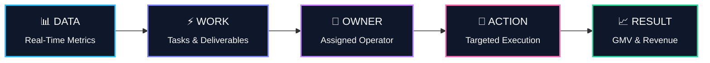

<div align="center">

# ⚡ Agency OS

### **The Enterprise Operational Command Center for Creator & Live Commerce Agencies**

*Turn creator rosters, campaign pipelines, content revisions, LIVE commerce, and financial reconciliation into assigned actions and measurable revenue.*

<br/>

[](https://nextjs.org/)
[](https://www.typescriptlang.org/)
[](https://tailwindcss.com/)
[](https://www.prisma.io/)
[](https://www.sqlite.org/)
[](LICENSE)

<br/>

[**Explore Features**](#-core-features--modules) • [**Tech Stack**](#-tech-stack) • [**Quick Start**](#-quick-start) • [**Scripts**](#-available-scripts) • [**Architecture**](#-security--architecture)

<br/>

</div>

---

## 💡 Core Philosophy: The Operational Loop

Traditional agencies suffer from disconnected spreadsheets, fragmented chat groups, and delayed financial reporting. **Agency OS** bridges analytics and frontline execution with a single, closed-loop operational framework:



### 🎯 Key Questions Answered in Real Time
- **Trend Detection**: What creators or campaigns are outperforming, and where is GMV dipping?
- **Execution Priority**: What mission-critical tasks and approvals must be completed today?
- **Unambiguous Ownership**: Who is the direct responsible individual (DRI) for every deliverable?
- **Financial Precision**: Exactly what are the gross GMV, creator commissions, and net agency margins?
- **SLA & Bottleneck Control**: Which reviews, drafts, or payouts are overdue?

---

## ✨ Core Features & Modules

<table>
<tr>
<td width="50%" valign="top">

### 📊 Overview Dashboard
Executive command center with real-time visibility.
- **Executive KPIs**: Live GMV, Agency Gross Revenue, Active Campaigns, and Pending Settlements.
- **Actionable Alerts**: Deterministic system triggers that highlight dropping metrics and critical bottlenecks.

<br/>

### 👥 Creators Management
Complete creator relationship & performance registry.
- **Health Scoring**: Automated status tags (`Healthy`, `Watch`, `At Risk`, `Inactive`).
- **Creator Profiles**: Platform account abstractions, niche tagging, and historical conversion metrics.

<br/>

### 🏢 Brand & Client Hub
Centralized partner relations and portfolio governance.
- **Account Profiles**: Client tiering, active contracts, and POC directories.
- **Revenue Attribution**: Real-time campaign ROI and client health tracking.

<br/>

### 🚀 Campaigns Pipeline
End-to-end lifecycle management from pitch to wrap-up.
- **Roster Building**: Creator talent matching and slot allocation.
- **Milestone Tracking**: Deliverable scheduling, budgeting, and performance reporting.

<br/>

### 🎙️ LIVE Operations Studio
Live commerce broadcast planning and execution.
- **Roster & Studio Scheduling**: Host, co-host, and operator shift management.
- **Real-Time Analytics**: Minute-by-minute GMV pacing against targets.

</td>
<td width="50%" valign="top">

### 📝 Content Production Kanban
High-velocity review and publication workflow.
- **Structured Pipeline**: 
  `Brief` ➔ `Draft` ➔ `Revision` ➔ `Approved` ➔ `Published`
- **Revision History**: Timestamped feedback logs and asset version control.

<br/>

### 📦 Product & SKU Intelligence
E-commerce catalog performance tracking.
- **Catalog Management**: SKU tracking with cross-channel performance correlation.
- **Content Attribution**: Identify top-selling SKUs across organic posts vs. LIVE streams.

<br/>

### 💵 Finance & Settlements Engine
Deterministic calculations with zero financial discrepancies.
- **Split Automation**: Real-time computation of gross GMV, creator commissions, and agency cuts.
- **Payout Tracking**: Settlement logs, invoice generation, and payout audit histories.

<br/>

### ✅ Tasks & Activity Matrix
Entity-linked task management for high-density operations.
- **Direct Context**: Tasks directly tied to Creators, Clients, Campaigns, or LIVE sessions.
- **Accountability**: Priority levels, due date tracking, and immutable audit logs.

<br/>

### 🛡️ Multi-Tenant Architecture
Enterprise-grade data isolation and security.
- **Tenant Isolation**: Strict `agencyId` scoping across all database queries.
- **RBAC**: Server-side Role-Based Access Control protecting sensitive financial data.

</td>
</tr>
</table>

---

## 🛠 Tech Stack

<div align="center">

| Area | Technologies | Details |
| :--- | :--- | :--- |
| **Frontend Framework** | `Next.js 14` (App Router) | Server Components, Streaming, API routes |
| **Language** | `TypeScript 5.0+` | Strict type safety end-to-end |
| **Styling & Icons** | `Tailwind CSS`, `Lucide React` | High-density, responsive, modern dark/light UI |
| **Data Visualization** | `Recharts` | Interactive operational and financial charts |
| **Schema Validation** | `Zod` | Runtime type checking and input sanitization |
| **Database & ORM** | `SQLite` (`better-sqlite3`), `Prisma ORM` | High-performance embedded DB *(Target: PostgreSQL)* |
| **Security & Auth** | `Jose JWT`, `Server-side RBAC` | Multi-tenant token isolation and role permissions |

</div>

---

## 🚀 Quick Start

### 1. Prerequisites
Ensure your environment meets the minimum version requirements:
- **Node.js**: `v18.17+` or `v20+` (LTS recommended)
- **Package Manager**: `npm` (bundled with Node) or `pnpm` / `yarn`

### 2. Setup & Installation

```bash
# Clone the repository
git clone https://github.com/SYTE001/Agency.git

# Navigate to the project directory
cd Agency

# Install project dependencies (automatically triggers Prisma Client generation)
npm install
```

### 3. Run Development Server

```bash
npm run dev
```

### 4. Launch Application
Open your browser and navigate to:
```
http://localhost:3000
```

> [!TIP]
> Database migrations and Prisma Client generation are automatically handled during `npm install` via the `postinstall` hook.

---

## 📜 Available Scripts

| Script | Command | Description |
| :--- | :--- | :--- |
| **Development** | `npm run dev` | Starts Next.js development server on port `3000` with Fast Refresh |
| **Production Build** | `npm run build` | Compiles TypeScript, bundles assets, and optimizes for production |
| **Start Production** | `npm run start` | Runs the compiled production build |
| **Linting** | `npm run lint` | Runs ESLint to inspect code quality and enforce standards |
| **Test Suite** | `npm run test` | Executes unit and integration test suites |

---

## 🔒 Security & Architecture Principles

> [!IMPORTANT]
> **Zero Trust Multi-Tenancy**: Data isolation by `agencyId` is strictly enforced at the server query layer, never relying purely on client-side state.

- **Deterministic Financial Engine**: All financial formulas (margins, creator shares, platform fees) reside in isolated backend utility modules to prevent math inconsistencies.
- **Operational Ergonomics**: High information density layout designed specifically for fast-paced operational teams managing dozens of parallel campaigns.

---

<div align="center">

## 📄 License & Confidentiality

**Proprietary & Confidential**  
Copyright © 2026 Agency OS. All rights reserved. Intended strictly for internal agency operations.

</div>
